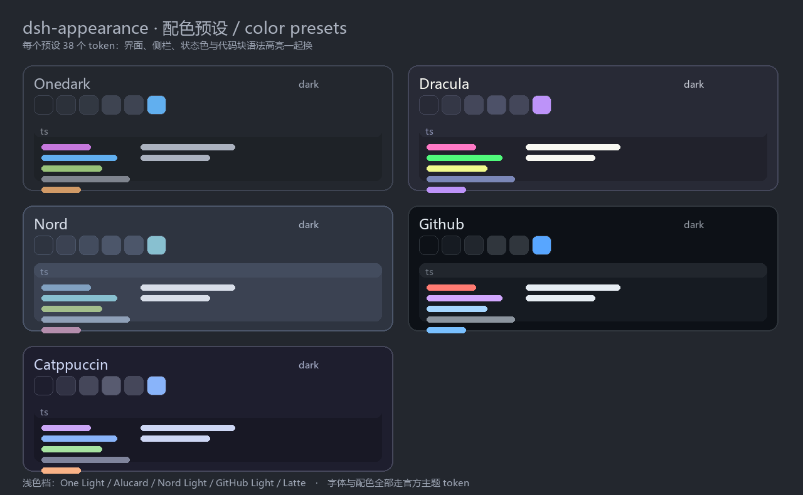

# dsh-appearance

**轻量的字体与主题插件** —— 给 DSH（DeepSeek Harness）桌面端 / Web 端加字体、配色预设、强调色与正文字号。不花哨：只改字体栈和颜色 token，没有动效、背景图或贴图皮肤。

  



## 亮点

| | |
|---|---|
| **轻** | 不打包字体文件、零运行时依赖、零构建步骤；仓库根就是插件包，两个 JS 文件 + 一份 42 个 token 的覆盖层，不改 DSH 源码 |
| **字体** | 中英文分两个框选，候选只列**本机已安装**的字体（Chromium Local Font Access）；代码字体单列 |
| **主题** | One Dark Pro（Darker 档）/ Dracula / Nord / GitHub / Catppuccin 五套**官方色板**；浅色一侧是 One Light / Alucard / Nord Light / GitHub Light / Latte |
| **覆盖** | 每个预设 42 个 token：底色、两级表面、四级文字、四档边框、状态色、卡片填充、代码块与 shiki 语法高亮——侧栏 / 菜单 / 卡片 / 代码块一起换 |
| **把关** | `npm run check` 逐个核对 token 名是否真的存在，并对 5 套预设 × 明暗两态 × 17 组做 WCAG 对比度检查，另有 54 项冒烟断言 |

## 配色预设

| 预设 | 深色底色 | 浅色底色 | 强调色 | 关键字 | 字符串 |
|---|---|---|---|---|---|
| **One Dark Pro** | `#1B1D23` | `#FAFAFA` | `#61AFEF` | `#C678DD` | `#98C379` |
| **Dracula** | `#191A21` | `#FFFBEB` | `#BD93F9` | `#FF79C6` | `#F1FA8C` |
| **Nord** | `#2E3440` | `#ECEFF4` | `#88C0D0` | `#81A1C1` | `#A3BE8C` |
| **GitHub** | `#0D1117` | `#FFFFFF` | `#58A6FF` | `#FF7B72` | `#A5D6FF` |
| **Catppuccin** | `#1E1E2E` | `#EFF1F5` | `#89B4FA` | `#CBA6F7` | `#A6E3A1` |

<details>
<summary>色板来源与两处最小偏离</summary>

取各主题**官方色值**，不做主观发挥——One Dark Pro 深色用 Darker 档（对话底取 `peekViewEditor.background` `#1B1D23`、面板/代码块取编辑器色 `#23272E`、再往上 `#2C313A`/`#323842` 是官方悬浮/选中色，正文 `#ABB2BF`，语法色取自扩展自带的 `OneDark-Pro-darker.json`），Dracula / Nord / GitHub Primer / Catppuccin 同理。

层级按各主题自己的关系排：**最暗的一档给对话底，面板/代码块取编辑器色，越往前的表面越亮**。这样既有面板感（对话底与内容差 8~11 级），整窗观感又和 VS Code 一致——早先两次偏差都出在这一层：一次把悬浮色当表面色（整窗偏亮），一次底色不够深（代码块和卡片跟背景糊在一起）。

只有两处偏离，都写在代码注释里：① 主题没公布的第四级灰阶按它自己的灰阶插值；② 浅色档里对比度不达标的原版彩色会压暗（例如 Latte 的粉彩）。

代码块底色取主题的**面板/控件表面**（VS Code 里 markdown 代码块就是这一层），所以代码块和对话底色一定分得开。另外四个 `--dsw-static-neutral-*` 填充（卡片头 / 悬停）也一并接管：deliverables / plan / schedule 这类卡片把它们写在**元素级**，不接管的话标题栏会停在 DSH 的固定近黑色（`#212123`）上，和卡片其它部分对不上。

仍未覆盖：菜单/浮层的模糊背板、终端 ANSI 色。明暗由「设置 → 通用」的外观切换决定，插件不另设开关。

</details>

## 装到 DSH

插件是一个**组合包（bundle）**：带 `dsh.bundle.patch` 的 npm 包。

要求 **DSH 0.2.0-rc.2 或更新**（`package.json` 的 `engines.dsh`）。这个字段是**声明式**的：宿主不会据此拒绝加载，它的用途是说明兼容范围。token 名会随宿主版本变化，换 DSH 版本后跑一次 `npm run verify` 即可核对。

**A. 界面安装（推荐，免命令行）** —— DSH 左侧「Plugins」→「添加插件」，填本仓库的绝对路径（仓库根就是插件包）：

```
D:\path\to\dsh-appearance
```

**B. 命令行安装**

```sh
# 从仓库装
npx -y --package @deepseek-ai/dsh dsh plugin --profile desktop add https://github.com/LX-HMKK/DSH-appearance
# 或本地目录
npx -y --package @deepseek-ai/dsh dsh plugin --profile desktop add D:\path\to\dsh-appearance
```

装完会把这行追加进 profile 的 `dsh.profile.bundles`，**重启一次 DSH**，然后在「设置 → 外观」里用。

<details>
<summary>没有 dsh CLI 时的手动 link 安装（已实测）</summary>

在 `$DSH_HOME/profiles/<profile>/` 下做三件事：

1. `package.json`：`dependencies` 加 `"dsh-appearance": "link:<本仓库绝对路径>"`，`dsh.profile.bundles` 数组追加 `"dsh-appearance"`；
2. `node_modules/dsh-appearance` 建目录联接（junction / symlink）指向**本仓库根**；
3. **在仓库根补一个 peer 链接**：`node_modules/@deepseek-ai/schemastery` → `<profile>/node_modules/@deepseek-ai/schemastery`。

少了第 3 步会踩坑：目录联接会让 Node 按**真实路径**（本仓库）向上找依赖，而 DSH 的运行时包在 profile 里，宿主半侧的 `import '@deepseek-ai/schemastery'` 会直接 ERR_MODULE_NOT_FOUND。

校验（在 profile 目录里跑，解析链与真实 loader 一致）：

```powershell
node -e "import('dsh-appearance').then(m => console.log(m.name, typeof m.apply, Object.keys(m.Config({}))))"
```

回滚：删掉依赖与 bundles 条目、删掉两个链接即可（安装前请备份 `package.json`）。

</details>

## 设置页里有三块

- **字体**：界面与正文字体（西文 / 中文两个框分开选）、代码字体、正文字号（10–22 px，与「设置 → 通用」同一个值）。
- **配色**：默认 / One Dark Pro / Dracula / Nord / GitHub / Catppuccin + 强调色、背景色、文字色，浅色与深色各一套。
- **高级**（默认折叠）：手动编辑字体栈、导入 / 导出整套设置（`dsh-appearance-v1:{...}`）、重置全部。

### Config 字段

| 字段 | 默认 | 含义 |
|---|---|---|
| `preset` | `default` | 配色预设 id（`onedark` / `dracula` / `nord` / `github` / `catppuccin`） |
| `uiFont` | `''` | 界面与正文字体栈；空 = 跟随 DSH 默认 |
| `codeFont` | `''` | 代码字体栈；空 = 跟随 DSH 默认 |
| `accentLight` / `accentDark` | `''` | 强调色，按明暗档分别覆盖 |
| `surfaceLight` / `surfaceDark` | `''` | 背景色 |
| `inkLight` / `inkDark` | `''` | 文字色 |

手填值**逐档**合并：只填了深色档时，浅色档保留预设的值。认不出的预设 id（例如旧版本删掉的那几套）一律按 `default` 处理。

## 开发

无构建步骤：改 `index.js` / `client.js` 直接生效。link 安装的 checkout 由 HMR 重载；**替换版本号才需要重启**。

```sh
npm test          # 冒烟测试（54 项断言）
npm run verify    # token 名 + 配色对比度
npm run check     # 两个都跑（提交前必跑）
```

<details>
<summary>仓库结构</summary>

```
仓库根 = 插件包本体（awesome-dsh-plugin 的 CI 只从根 / packages / plugins / apps 读 package.json）
├─ package.json          dsh.bundle.patch + dsh.client 两半侧的声明，以及开发用 scripts
├─ cordis.patch.yml      组合包层：插入插件行（行 id = 设置命名空间）
├─ index.js              宿主半侧：Config schema + 首屏字体注入
├─ client.js             浏览器半侧：设置页 + token 覆盖层（无构建）
├─ locale/{zh,en}.json   插件卡片的显示名与描述
├─ screenshots.json      插件市场详情页的截图清单
├─ assets/               截图与配色预览图
└─ tools/                开发工具（零依赖纯 Node）
   ├─ smoke-test.mjs     假 React + 假 ctx，把插件真跑一遍
   ├─ verify.mjs         token 名校验 + 配色对比度校验
   ├─ gen-presets.cjs    色板 → 42 个 token 字面量的生成器
   └─ asar.mjs           直接读取 DSH 的 app.asar（排查内部实现用）
```

</details>

<details>
<summary>设计说明：为什么必须有宿主半侧</summary>

两件事只有宿主（Node）能做：

1. **设置命名空间**。DSH 的设置命名空间就是 **Loader 行的 id**，客户端插件无法自建。所以持久化必须由宿主半侧导出 `Config`（volatile 字段），浏览器半侧才能用 `ctx.configForms.get('dsh-appearance')` 读写。
2. **首屏注入**。`webserver/index-inject` 是宿主侧的扩展点；客户端 CSS 要等 JS 模块图加载完才到。没有这一步，每次刷新都会先看到默认字体、再跳成用户选的字体。

数据流：

```
用户改动
  └─> ctx.configForms.get('dsh-appearance').set/unset
        └─> Host 校验 + 写入 profile 的 cordis.patch.yml（volatile 字段，带 revision）
              └─> 快照回流（subscribe）
                    ├─> 宿主：下次渲染 index 时把字体写进 <head>（首屏即正确）
                    └─> 客户端：ctx.theme.overrideTokens('dsh-appearance', {...})
                          └─> ui-layout 把 token 写成 body 内联样式，即时生效
```

</details>

<details>
<summary>设计说明：三个关键取舍</summary>

| 决策 | 原因 |
|---|---|
| 字体/颜色统一走 `ctx.theme.overrideTokens` | 官方给第三方留的主题扩展点：自带明暗双态、可撤销、随 HMR / 禁用自动回收。自己写 CSS 变量会和 ui-theme 的样式表打级联架。 |
| 首屏样式用 `html:root` 而不是 `:root` | 该行被插在 `<head>` 最前面，而 ui-theme 的 base.css 也是 `:root`。`html:root` 特异度更高（0,1,1 > 0,1,0），才能在样式表加载后继续生效；插件加载后由 ui-layout 的 body 内联样式接管，两者不冲突。 |
| 字号直接复用 `ctx.theme.setFontSize` | `--dsh-content-font-size` 由 ui-layout 在**每次**主题快照时重写，插件自己设会被冲掉；而且组件高度是按该轴的阶梯（`calc(33px + var(--dsh-content-font-delta))`）推导的，绕过去会错位。 |

</details>

<details>
<summary>已知边界（有意不做）</summary>

- **终端字体**：xterm 面板硬编码 `fontSize: 13` 与自己的字体名，并按自测字符宽度算 cols/rows；纯 CSS 改字体会让终端网格错位（终端 ANSI 配色同理不在覆盖范围内）。
- **UI 全局字号**：组件高度由字号轴阶梯推导，整体缩放会错位；只做官方支持的对话字号（10–22 px）。
- **自带字体文件**：现在只用系统已装字体 + 精选字体栈（零文件、零许可风险）。字体包与 `@font-face` 放在后续版本。
- **配色不做首屏注入**：配色是明暗双态的，需要把预设表同时给到两半侧；现在只在插件加载后即时应用（会有极短的默认配色过渡）。

</details>

## 字体与许可

- 插件**不打包任何字体文件**，只是把字体栈字符串交给浏览器；找不到就回退，不会报错。
- 想自带字体（后续版本）时只收 OFL 授权的字体，并随包附带许可证——DSH 自己就是这么做的（`montserrat-*.woff2` 旁边就是 `Montserrat-OFL.txt`）。
- **不要**打包 SF Pro / SF Mono、Segoe UI、苹方、微软雅黑等系统字体：再分发属于侵权。把它们的名字写进 fallback 栈没问题，带文件不行。

## 路线

- **v0.2**：配色首屏注入（预设表下沉为两半侧共享的数据文件）、更多预设。
- **v0.3**：导入 Codex 的 `codex-theme-v1:` 主题串（字段映射到 `--dsw-*` token）。
- **v0.4**：自带字体（`@font-face` + 同源路由 + preload + `font-display: block` + 度量覆盖，避免会话滚动锚点抖动）。

## 卸载与许可

```sh
npx -y --package @deepseek-ai/dsh dsh plugin --profile desktop remove dsh-appearance
```

或在「Plugins → 已安装」里关掉 / 移除；卸载后本插件写入的 token 覆盖层与首屏样式都会一并回收。

MIT © LX-HMKK
